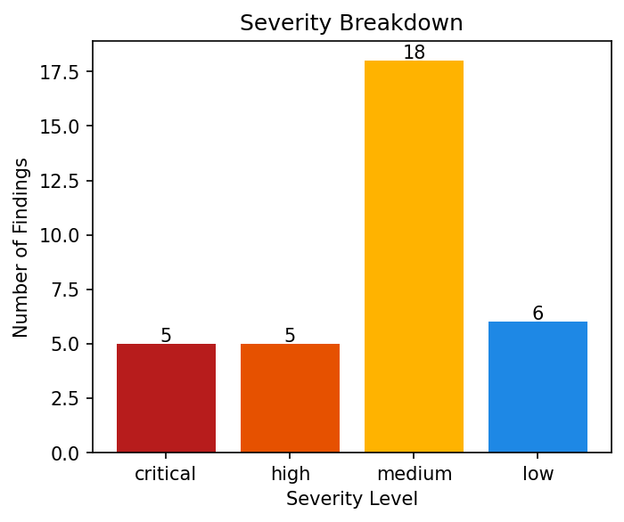
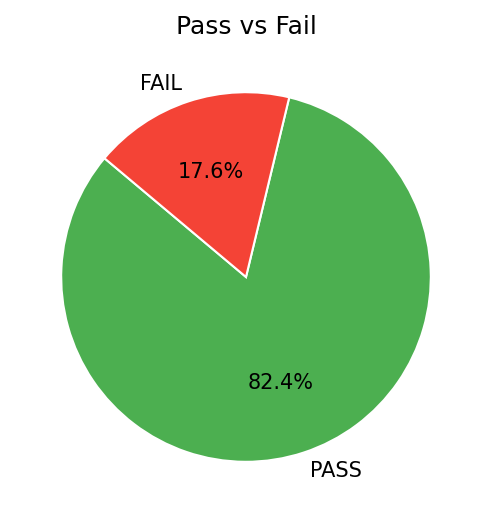

<div class="report-header">
  <h1 style="text-align: center; color: #2C3E50;">AWS SECURITY REMEDIATION REPORT</h1>
  <p style="text-align: center; color: #7F8C8D;">Generated by PDCA Security Agent | 2025-12-13</p>
</div>

---

# 1. Tóm tắt điều hành
**Executive Summary**

Trong báo cáo đánh giá bảo mật Amazon S3, chúng tôi đã thực hiện một cuộc quét toàn diện trên tài khoản với ID 065209282642 trong khu vực us-east-1. Qua quá trình này, chúng tôi đã xác định được tổng số findings là 34, trong đó có 6 finding FAIL (lỗi) và 28 finding PASS (đúng). Các lỗi chính bao gồm:

* Mất dữ liệu do thiếu phiên bản hóa và kiểm soát quyền truy cập
* Truy cập công khai do bucket không được cấu hình đúng cách
* Chưa sử dụng mã hóa đối với dữ liệu lưu trữ

Tóm tắt hiện trạng an ninh của tài khoản, chúng tôi nhận thấy rằng cần phải cải thiện các biện pháp bảo mật để đạt được mức độ trưởng thành cao hơn. Để đạt được mục tiêu này, chúng tôi đề xuất một số định hướng chiến lược:

* Cải thiện phiên bản hóa và kiểm soát quyền truy cập để ngăn chặn mất dữ liệu
* Cấu hình bucket đúng cách để ngăn chặn truy cập công khai
* Sử dụng mã hóa đối với dữ liệu lưu trữ để đảm bảo an toàn

Tổng quan, báo cáo đánh giá bảo mật Amazon S3 cho thấy rằng tài khoản cần phải cải thiện các biện pháp bảo mật để đạt được mức độ trưởng thành cao hơn. Chúng tôi hy vọng rằng những đề xuất trong báo cáo sẽ giúp tài khoản đạt được mục tiêu này và đảm bảo an toàn cho dữ liệu lưu trữ.

---

# 2. Tổng quan hệ thống & Mục tiêu

## 2.1 Bối cảnh hệ thống
| Thuộc tính | Chi tiết |
| :--- | :--- |
| **Tài khoản AWS** | `065209282642` |
| **Vùng (Region)** | us-east-1 |
| **Phạm vi quét** | ['s3'] |
| **Công cụ sử dụng** | Prowler, AWS SDK, PDCA Security Agent |

**Mô tả hệ thống**

Hệ thống này được thiết kế để quản lý và bảo mật tài liệu quan trọng của một tổ chức, tập trung vào việc sử dụng Amazon S3 như một Data Lake để lưu trữ và bảo vệ dữ liệu. Hệ thống này cũng bao gồm các công cụ và kỹ thuật khác nhau để đảm bảo tính an toàn và tuân thủ các tiêu chuẩn bảo mật.

**Vai trò của Amazon S3**

Amazon S3 đóng vai trò quan trọng trong hệ thống này, cung cấp một không gian lưu trữ lớn và an toàn cho dữ liệu. Hệ thống sử dụng S3 như một Data Lake để lưu trữ dữ liệu từ nhiều nguồn khác nhau, bao gồm cả dữ liệu được tạo ra bởi các ứng dụng và dịch vụ của tổ chức.

**Chiến lược đánh giá**

Dưới đây là các trọng tâm đánh giá chính trong hệ thống này:

*   **Access Control**: Đảm bảo rằng chỉ có người có thẩm quyền mới có thể truy cập vào tài liệu quan trọng.
*   **Data Encryption**: Sử dụng các phương pháp mã hóa để bảo vệ dữ liệu khỏi việc truy cập trái phép.
*   **Public Exposure Prevention**: Đảm bảo rằng dữ liệu không được lộ ra công chúng.
*   **Data Resilience**: Thiết kế hệ thống để có thể phục hồi nhanh chóng sau sự cố.
*   **Compliance with AWS Well-Architected Framework**: Tuân thủ các tiêu chuẩn bảo mật và quản lý của Amazon Web Services.

Tổng quan, hệ thống này được thiết kế để cung cấp một môi trường an toàn và bảo mật cho dữ liệu quan trọng của tổ chức. Bằng cách sử dụng các công cụ và kỹ thuật khác nhau, hệ thống này đảm bảo rằng dữ liệu được bảo vệ khỏi việc truy cập trái phép và tuân thủ các tiêu chuẩn bảo mật cao nhất.

## 2.2 Mục tiêu đánh giá
**Assessment Goals**

Mục tiêu tổng quát của báo cáo đánh giá cấu hình AWS là rà soát tư thế bảo mật (Security Posture) và giảm thiểu rủi ro sai cấu hình để đảm bảo tính an toàn và tuân thủ các quy định.

Mục tiêu cụ thể:

*   **Kiểm soát truy cập:** Đánh giá hiệu quả của chính sách truy cập và xác định các điểm yếu cần cải thiện để ngăn chặn việc truy cập trái phép vào tài nguyên AWS.
*   **Mã hóa dữ liệu:** Xác minh rằng dữ liệu được mã hóa đúng cách và tuân thủ các tiêu chuẩn về bảo mật như GDPR, HIPAA v.v. để đảm bảo sự an toàn cho dữ liệu.
*   **Logging & Monitoring:** Đánh giá hiệu quả của hệ thống ghi log và giám sát để phát hiện sớm các hoạt động đáng ngờ và ngăn chặn các cuộc tấn công mạng.
*   **Tuân thủ Best Practices (CIS/Well-Architected):** Xác minh rằng tài nguyên AWS tuân thủ các tiêu chuẩn về bảo mật và hiệu suất như CIS, Well-Architected Framework để đảm bảo tính an toàn và hiệu quả.

Bằng cách đạt được những mục tiêu này, báo cáo đánh giá cấu hình AWS sẽ cung cấp một cái nhìn tổng quan về tư thế bảo mật của tổ chức và đề xuất các giải pháp cải thiện để giảm thiểu rủi ro sai cấu hình.

---

# 3. Tổng quan trước khắc phục

## 3.1 Trạng thái bảo mật ban đầu

**Thống kê:**
* **Tổng số phát hiện:** 34
* **ĐẠT (PASS):** 28
* **KHÔNG ĐẠT (FAIL):** 6

**Phân bổ mức độ nghiêm trọng:**
* Nghiêm trọng (Critical): **5**
* Cao (High): **5**
* Trung bình (Medium): **18**
* Thấp (Low): **6**

## 3.2 Phân tích trực quan

<table>
  <tr>
    <td align="center" width="50%">
      
    </td>
    <td align="center" width="50%">
      
    </td>
  </tr>
</table>

## 3.3 Phân tích phát hiện
### Tổng quan các mục ĐẠT
**PASS FINDINGS OVERVIEW**

Tổng quan, hệ thống có tổng cộng 28 PASS, phân bố theo mức độ nghiêm trọng như sau: 5 PASS cấp độ critical, 5 PASS cấp độ high, 14 PASS cấp độ medium và 4 PASS cấp độ low.

Xu hướng chung của các cấu hình đúng là:

* Cài đặt chính sách bảo mật cho tất cả các bucket S3.
* Bật secure transport policy cho tất cả các bucket S3.
* Bật server access logging cho tất cả các bucket S3.
* Không có bucket S3 có ACLs không được bật.
* Không có bucket S3 có public access không được kiểm soát.

Các mục này được xem là cấu hình tốt vì chúng giúp ngăn chặn các cuộc tấn công và bảo vệ dữ liệu của hệ thống. Các thực hành tốt mà hệ thống đã tuân thủ bao gồm việc cài đặt chính sách bảo mật, bật secure transport policy, bật server access logging và đảm bảo rằng không có bucket S3 có ACLs hoặc public access không được kiểm soát.

Tác động tích cực của các PASS này là:

* Hệ thống có posture bảo mật tốt hơn.
* Tác dụng đối với compliance / risk mitigation là giảm thiểu rủi ro và tăng cường an ninh cho hệ thống.

### Tổng quan các mục KHÔNG ĐẠT
**FAIL FINDINGS OVERVIEW**

Tổng quan, có 6 FAIL được phát hiện trong hệ thống AWS của khách hàng, phân bố theo mức độ severity và event_code như sau:

- Tổng FAIL: 6
- FAIL theo mức độ severity: {'critical': 0, 'high': 0, 'medium': 4, 'low': 2}
- FAIL theo event_code: {'s3_bucket_cross_region_replication': 2, 's3_bucket_kms_encryption': 2, 's3_bucket_no_mfa_delete': 2}

Các nhóm cấu hình đang thiếu sót bao gồm:

- Không có KMS encryption cho các bucket S3
- Không có MFA Delete cho các bucket S3

Xu hướng sai cấu hình phổ biến là không sử dụng cross-region replication cho các bucket S3, không sử dụng KMS encryption và không bật MFA Delete cho các bucket S3.

**Phân tích rủi ro cấp cao**

Các FAIL này liên quan đến việc bảo mật dữ liệu trong hệ thống AWS. Nếu không được khắc phục, có thể dẫn đến:

- Mất dữ liệu: Nếu không sử dụng cross-region replication, dữ liệu sẽ bị mất nếu khu vực lưu trữ bị ảnh hưởng bởi sự cố.
- Lộ dữ liệu: Nếu không sử dụng KMS encryption, dữ liệu sẽ bị lộ cho người dùng không được phép truy cập.
- Vi phạm truy cập: Nếu không bật MFA Delete, người dùng có thể thực hiện hành vi không hợp lệ trên các bucket S3.

Các finding này quan trọng vì chúng liên quan đến việc bảo mật dữ liệu và đảm bảo tính toàn vẹn của hệ thống.

**Đánh giá posture ban đầu**

Hệ thống đang ở mức độ trưởng thành bảo mật thấp. Có nhiều sai sót trong cấu hình bảo mật, bao gồm không sử dụng cross-region replication, không sử dụng KMS encryption và không bật MFA Delete cho các bucket S3. Điều này làm tăng rủi ro mất dữ liệu, lộ dữ liệu và vi phạm truy cập.

---

# 4. Bảng chi tiết các phát hiện

<div class="table-container">
<table class="styled-table">
<thead>
<tr style="background-color: #009879; color: #ffffff; text-align: left;">
  <th>STT</th>
  <th>Phát hiện</th>
  <th>Dịch vụ</th>
  <th>Tài nguyên</th>
  <th>Mức độ</th>
  <th>Trước</th>
  <th>Sau</th>
  <th>Trạng thái</th>
</tr>
</thead>
<tbody>

<tr class="active-row">
  <td>1</td>
  <td>Check S3 Account Level Public Access Block.</td>
  <td>s3</td>
  <td><small>065209282642</small></td>
  <td>
     
    high
  </td>
  <td>PASS</td>
  <td>PASS</td>
  <td style="font-weight: bold; color: red;">
    Unchanged
  </td>
</tr>

<tr class="active-row">
  <td>2</td>
  <td>Check if S3 buckets have ACLs enabled</td>
  <td>s3</td>
  <td><small>logs-065209282642-us-east-1</small></td>
  <td>
     
    medium
  </td>
  <td>PASS</td>
  <td>PASS</td>
  <td style="font-weight: bold; color: red;">
    Unchanged
  </td>
</tr>

<tr class="active-row">
  <td>3</td>
  <td>Check if S3 buckets have ACLs enabled</td>
  <td>s3</td>
  <td><small>prowler-test-public-bucket</small></td>
  <td>
     
    medium
  </td>
  <td>PASS</td>
  <td>PASS</td>
  <td style="font-weight: bold; color: red;">
    Unchanged
  </td>
</tr>

<tr class="active-row">
  <td>4</td>
  <td>This check verifies that S3 bucket policies are configured in a way that limits access to the intended AWS accounts only, preventing unauthorized access by external or unintended accounts.</td>
  <td>s3</td>
  <td><small>logs-065209282642-us-east-1</small></td>
  <td>
     
    high
  </td>
  <td>PASS</td>
  <td>PASS</td>
  <td style="font-weight: bold; color: red;">
    Unchanged
  </td>
</tr>

<tr class="active-row">
  <td>5</td>
  <td>This check verifies that S3 bucket policies are configured in a way that limits access to the intended AWS accounts only, preventing unauthorized access by external or unintended accounts.</td>
  <td>s3</td>
  <td><small>prowler-test-public-bucket</small></td>
  <td>
     
    high
  </td>
  <td>PASS</td>
  <td>PASS</td>
  <td style="font-weight: bold; color: red;">
    Unchanged
  </td>
</tr>

<tr class="active-row">
  <td>6</td>
  <td>Verifying whether S3 buckets have cross-region replication enabled, ensuring data redundancy and availability across multiple AWS regions</td>
  <td>s3</td>
  <td><small>logs-065209282642-us-east-1</small></td>
  <td>
     
    low
  </td>
  <td>FAIL</td>
  <td>FAIL</td>
  <td style="font-weight: bold; color: red;">
    Still Failing (ManualRequired)
  </td>
</tr>

<tr class="active-row">
  <td>7</td>
  <td>Verifying whether S3 buckets have cross-region replication enabled, ensuring data redundancy and availability across multiple AWS regions</td>
  <td>s3</td>
  <td><small>prowler-test-public-bucket</small></td>
  <td>
     
    low
  </td>
  <td>FAIL</td>
  <td>FAIL</td>
  <td style="font-weight: bold; color: red;">
    Still Failing (ManualRequired)
  </td>
</tr>

<tr class="active-row">
  <td>8</td>
  <td>Check if S3 buckets have default encryption (SSE) enabled or use a bucket policy to enforce it.</td>
  <td>s3</td>
  <td><small>logs-065209282642-us-east-1</small></td>
  <td>
     
    medium
  </td>
  <td>PASS</td>
  <td>PASS</td>
  <td style="font-weight: bold; color: red;">
    Unchanged
  </td>
</tr>

<tr class="active-row">
  <td>9</td>
  <td>Check if S3 buckets have default encryption (SSE) enabled or use a bucket policy to enforce it.</td>
  <td>s3</td>
  <td><small>prowler-test-public-bucket</small></td>
  <td>
     
    medium
  </td>
  <td>PASS</td>
  <td>PASS</td>
  <td style="font-weight: bold; color: red;">
    Unchanged
  </td>
</tr>

<tr class="active-row">
  <td>10</td>
  <td>Ensure whether S3 buckets have event notifications enabled.</td>
  <td>s3</td>
  <td><small>logs-065209282642-us-east-1</small></td>
  <td>
     
    medium
  </td>
  <td>PASS</td>
  <td>PASS</td>
  <td style="font-weight: bold; color: red;">
    Unchanged
  </td>
</tr>

<tr class="active-row">
  <td>11</td>
  <td>Ensure whether S3 buckets have event notifications enabled.</td>
  <td>s3</td>
  <td><small>prowler-test-public-bucket</small></td>
  <td>
     
    medium
  </td>
  <td>PASS</td>
  <td>PASS</td>
  <td style="font-weight: bold; color: red;">
    Unchanged
  </td>
</tr>

<tr class="active-row">
  <td>12</td>
  <td>Check if S3 buckets have KMS encryption enabled.</td>
  <td>s3</td>
  <td><small>logs-065209282642-us-east-1</small></td>
  <td>
     
    medium
  </td>
  <td>FAIL</td>
  <td>PASS</td>
  <td style="font-weight: bold; color: red;">
    Fixed
  </td>
</tr>

<tr class="active-row">
  <td>13</td>
  <td>Check if S3 buckets have KMS encryption enabled.</td>
  <td>s3</td>
  <td><small>prowler-test-public-bucket</small></td>
  <td>
     
    medium
  </td>
  <td>FAIL</td>
  <td>PASS</td>
  <td style="font-weight: bold; color: red;">
    Fixed
  </td>
</tr>

<tr class="active-row">
  <td>14</td>
  <td>Check S3 Bucket Level Public Access Block.</td>
  <td>s3</td>
  <td><small>logs-065209282642-us-east-1</small></td>
  <td>
     
    medium
  </td>
  <td>PASS</td>
  <td>PASS</td>
  <td style="font-weight: bold; color: red;">
    Unchanged
  </td>
</tr>

<tr class="active-row">
  <td>15</td>
  <td>Check S3 Bucket Level Public Access Block.</td>
  <td>s3</td>
  <td><small>prowler-test-public-bucket</small></td>
  <td>
     
    medium
  </td>
  <td>PASS</td>
  <td>PASS</td>
  <td style="font-weight: bold; color: red;">
    Unchanged
  </td>
</tr>

<tr class="active-row">
  <td>16</td>
  <td>Check if S3 buckets have Lifecycle configuration enabled.</td>
  <td>s3</td>
  <td><small>logs-065209282642-us-east-1</small></td>
  <td>
     
    low
  </td>
  <td>PASS</td>
  <td>PASS</td>
  <td style="font-weight: bold; color: red;">
    Unchanged
  </td>
</tr>

<tr class="active-row">
  <td>17</td>
  <td>Check if S3 buckets have Lifecycle configuration enabled.</td>
  <td>s3</td>
  <td><small>prowler-test-public-bucket</small></td>
  <td>
     
    low
  </td>
  <td>PASS</td>
  <td>PASS</td>
  <td style="font-weight: bold; color: red;">
    Unchanged
  </td>
</tr>

<tr class="active-row">
  <td>18</td>
  <td>Check if S3 bucket MFA Delete is not enabled.</td>
  <td>s3</td>
  <td><small>logs-065209282642-us-east-1</small></td>
  <td>
     
    medium
  </td>
  <td>FAIL</td>
  <td>FAIL</td>
  <td style="font-weight: bold; color: red;">
    Still Failing (ManualRequired)
  </td>
</tr>

<tr class="active-row">
  <td>19</td>
  <td>Check if S3 bucket MFA Delete is not enabled.</td>
  <td>s3</td>
  <td><small>prowler-test-public-bucket</small></td>
  <td>
     
    medium
  </td>
  <td>FAIL</td>
  <td>FAIL</td>
  <td style="font-weight: bold; color: red;">
    Still Failing (ManualRequired)
  </td>
</tr>

<tr class="active-row">
  <td>20</td>
  <td>Check if S3 buckets have object lock enabled</td>
  <td>s3</td>
  <td><small>logs-065209282642-us-east-1</small></td>
  <td>
     
    low
  </td>
  <td>PASS</td>
  <td>PASS</td>
  <td style="font-weight: bold; color: red;">
    Unchanged
  </td>
</tr>

<tr class="active-row">
  <td>21</td>
  <td>Check if S3 buckets have object lock enabled</td>
  <td>s3</td>
  <td><small>prowler-test-public-bucket</small></td>
  <td>
     
    low
  </td>
  <td>PASS</td>
  <td>PASS</td>
  <td style="font-weight: bold; color: red;">
    Unchanged
  </td>
</tr>

<tr class="active-row">
  <td>22</td>
  <td>Check if S3 buckets have object versioning enabled</td>
  <td>s3</td>
  <td><small>logs-065209282642-us-east-1</small></td>
  <td>
     
    medium
  </td>
  <td>PASS</td>
  <td>PASS</td>
  <td style="font-weight: bold; color: red;">
    Unchanged
  </td>
</tr>

<tr class="active-row">
  <td>23</td>
  <td>Check if S3 buckets have object versioning enabled</td>
  <td>s3</td>
  <td><small>prowler-test-public-bucket</small></td>
  <td>
     
    medium
  </td>
  <td>PASS</td>
  <td>PASS</td>
  <td style="font-weight: bold; color: red;">
    Unchanged
  </td>
</tr>

<tr class="active-row">
  <td>24</td>
  <td>Check if S3 buckets have policies which allow WRITE access.</td>
  <td>s3</td>
  <td><small>logs-065209282642-us-east-1</small></td>
  <td>
     
    critical
  </td>
  <td>PASS</td>
  <td>PASS</td>
  <td style="font-weight: bold; color: red;">
    Unchanged
  </td>
</tr>

<tr class="active-row">
  <td>25</td>
  <td>Check if S3 buckets have policies which allow WRITE access.</td>
  <td>s3</td>
  <td><small>prowler-test-public-bucket</small></td>
  <td>
     
    critical
  </td>
  <td>PASS</td>
  <td>PASS</td>
  <td style="font-weight: bold; color: red;">
    Unchanged
  </td>
</tr>

<tr class="active-row">
  <td>26</td>
  <td>Ensure there are no S3 buckets open to Everyone or Any AWS user.</td>
  <td>s3</td>
  <td><small>065209282642</small></td>
  <td>
     
    critical
  </td>
  <td>PASS</td>
  <td>PASS</td>
  <td style="font-weight: bold; color: red;">
    Unchanged
  </td>
</tr>

<tr class="active-row">
  <td>27</td>
  <td>Ensure there are no S3 buckets listable by Everyone or Any AWS customer.</td>
  <td>s3</td>
  <td><small>065209282642</small></td>
  <td>
     
    critical
  </td>
  <td>PASS</td>
  <td>PASS</td>
  <td style="font-weight: bold; color: red;">
    Unchanged
  </td>
</tr>

<tr class="active-row">
  <td>28</td>
  <td>Ensure there are no S3 buckets writable by Everyone or Any AWS customer.</td>
  <td>s3</td>
  <td><small>065209282642</small></td>
  <td>
     
    critical
  </td>
  <td>PASS</td>
  <td>PASS</td>
  <td style="font-weight: bold; color: red;">
    Unchanged
  </td>
</tr>

<tr class="active-row">
  <td>29</td>
  <td>Check if S3 buckets have secure transport policy.</td>
  <td>s3</td>
  <td><small>logs-065209282642-us-east-1</small></td>
  <td>
     
    medium
  </td>
  <td>PASS</td>
  <td>PASS</td>
  <td style="font-weight: bold; color: red;">
    Unchanged
  </td>
</tr>

<tr class="active-row">
  <td>30</td>
  <td>Check if S3 buckets have secure transport policy.</td>
  <td>s3</td>
  <td><small>prowler-test-public-bucket</small></td>
  <td>
     
    medium
  </td>
  <td>PASS</td>
  <td>PASS</td>
  <td style="font-weight: bold; color: red;">
    Unchanged
  </td>
</tr>

<tr class="active-row">
  <td>31</td>
  <td>Check if S3 buckets have server access logging enabled</td>
  <td>s3</td>
  <td><small>logs-065209282642-us-east-1</small></td>
  <td>
     
    medium
  </td>
  <td>PASS</td>
  <td>PASS</td>
  <td style="font-weight: bold; color: red;">
    Unchanged
  </td>
</tr>

<tr class="active-row">
  <td>32</td>
  <td>Check if S3 buckets have server access logging enabled</td>
  <td>s3</td>
  <td><small>prowler-test-public-bucket</small></td>
  <td>
     
    medium
  </td>
  <td>PASS</td>
  <td>PASS</td>
  <td style="font-weight: bold; color: red;">
    Unchanged
  </td>
</tr>

<tr class="active-row">
  <td>33</td>
  <td>Checks for S3 buckets with predictable names that could be hijacked by an attacker before legitimate use, leading to data leakage or other security breaches.</td>
  <td>s3</td>
  <td><small>logs-065209282642-us-east-1</small></td>
  <td>
     
    high
  </td>
  <td>PASS</td>
  <td>PASS</td>
  <td style="font-weight: bold; color: red;">
    Unchanged
  </td>
</tr>

<tr class="active-row">
  <td>34</td>
  <td>Checks for S3 buckets with predictable names that could be hijacked by an attacker before legitimate use, leading to data leakage or other security breaches.</td>
  <td>s3</td>
  <td><small>prowler-test-public-bucket</small></td>
  <td>
     
    high
  </td>
  <td>PASS</td>
  <td>PASS</td>
  <td style="font-weight: bold; color: red;">
    Unchanged
  </td>
</tr>

</tbody>
</table>
</div>

---

# 5. Chi tiết thực thi khắc phục

## 5.1 Khắc phục thành công

### 1. Enable KMS Encryption

**Thông tin thực thi:**
* **Tài nguyên:** `logs-065209282642-us-east-1`
* **Công cụ (Tool):** `s3_enable_kms_encryption`
* **Tham số (Payload):** `{"action": "Enable KMS Encryption", "resource": "logs-065209282642-us-east-1", "status": "enabled", "success": true}`

> **PHÂN TÍCH KỸ THUẬT:**
>
> **Phân tích Vấn đề & Rủi ro:**
> 
> - Tài nguyên `logs-065209282642-us-east-1` không đạt chuẩn do trạng thái trước là `FAIL`, với mức độ nghiêm trọng là `medium`. Điều này cho thấy tài nguyên không được mã hóa bằng cách sử dụng KMS Encryption, dẫn đến rủi ro dữ liệu bị lộ hoặc thiếu tính toàn vẹn.
> 
> - Nếu không khắc phục, tình trạng này có thể gây ra hậu quả nghiêm trọng như việc dữ liệu nhạy cảm bị truy cập trái phép, dẫn đến mất an ninh và uy tín cho tổ chức. Việc mã hóa bằng KMS Encryption là một biện pháp quan trọng để bảo vệ dữ liệu khỏi các cuộc tấn công mạng.
> 
> **Chi tiết Kỹ thuật Thực thi:**
> 
> - Công cụ `s3_enable_kms_encryption` được sử dụng để thực hiện remediation. Công cụ này có thể thêm rule SSE-KMS vào tài nguyên, giúp mã hóa dữ liệu bằng cách sử dụng KMS Key.
> - Khi thực hiện remediation, công cụ sẽ:
>   - Tạo một policy JSON để cấu hình mã hóa SSE-KMS cho tài nguyên.
>   - Thêm rule SSE-KMS vào tài nguyên để bắt đầu mã hóa dữ liệu.
>   - Nếu có KMS Key được cung cấp, sẽ sử dụng nó để mã hóa dữ liệu.
> 
> - Cơ chế bảo mật liên quan đến logic triển khai là việc sử dụng KMS Encryption để mã hóa dữ liệu. Điều này giúp đảm bảo rằng dữ liệu chỉ có thể truy cập bởi người dùng được ủy quyền và được mã hóa bằng cách sử dụng một khóa KMS.
> 
> **Xác nhận Kết quả:**
> 
> - Trạng thái sau remediation là `PASS`, cho thấy tài nguyên đã đạt chuẩn và được mã hóa bằng cách sử dụng KMS Encryption.
> - Lợi ích bảo mật khi trạng thái chuyển sang PASS là việc dữ liệu được mã hóa và chỉ có thể truy cập bởi người dùng được ủy quyền, giúp giảm thiểu rủi ro dữ liệu bị lộ hoặc thiếu tính toàn vẹn.
> - Kết luận remediation dựa trên execution_output, AFTER, và logic tool là rằng remediation thành công đã giúp tài nguyên đạt chuẩn và được mã hóa bằng cách sử dụng KMS Encryption.

<details>
<summary><i>Xem nhật ký thực thi chi tiết (Raw Log)</i></summary>

```yaml
action: Enable KMS Encryption
resource: logs-065209282642-us-east-1
status: enabled
success: true

```
</details>

---

### 2. Enable KMS Encryption

**Thông tin thực thi:**
* **Tài nguyên:** `prowler-test-public-bucket`
* **Công cụ (Tool):** `s3_enable_kms_encryption`
* **Tham số (Payload):** `{"action": "Enable KMS Encryption", "resource": "prowler-test-public-bucket", "status": "enabled", "success": true}`

> **PHÂN TÍCH KỸ THUẬT:**
>
> **Phân tích Vấn đề & Rủi ro:**
> 
> - Tài nguyên `prowler-test-public-bucket` không đạt chuẩn do trạng thái trước là `FAIL`, với mức độ nghiêm trọng là `medium`. Điều này cho thấy tài nguyên không được mã hóa bằng cách sử dụng KMS (Key Management Service) của AWS, dẫn đến rủi ro dữ liệu bị lộ hoặc thiếu tính toàn vẹn.
> 
> - Nếu không khắc phục, tình trạng này có thể gây ra hậu quả nghiêm trọng như việc dữ liệu nhạy cảm bị truy cập trái phép, dẫn đến mất an ninh và uy tín cho tổ chức. Ngoài ra, việc không mã hóa dữ liệu cũng vi phạm các quy định bảo mật và chính sách của AWS.
> 
> **Chi tiết Kỹ thuật Thực thi:**
> 
> - Công cụ `s3_enable_kms_encryption` được sử dụng để thực hiện remediation. Công cụ này hoạt động bằng cách thêm một quy tắc SSE-KMS vào tài nguyên, giúp mã hóa dữ liệu trong bucket.
> - Khi thực hiện remediation, công cụ này tương tác với dịch vụ S3 của AWS và cập nhật cấu hình bảo mật cho bucket. Cụ thể, nó thêm một quy tắc `ApplyServerSideEncryptionByDefault` với giá trị `aws:kms`, giúp mã hóa dữ liệu khi lưu trữ trong bucket.
> - Cơ chế bảo mật liên quan đến việc sử dụng KMS (Key Management Service) của AWS, giúp quản lý và cấp quyền truy cập vào các khóa mã hóa. Trong trường hợp này, công cụ `s3_enable_kms_encryption` giúp tạo một quy tắc để áp dụng mã hóa SSE-KMS cho bucket.
> 
> **Xác nhận Kết quả:**
> 
> - Trạng thái sau remediation là `PASS`, cho thấy tài nguyên đã đạt chuẩn và được mã hóa bằng cách sử dụng KMS.
> - Lợi ích bảo mật khi trạng thái chuyển sang PASS là việc dữ liệu trong bucket được mã hóa và bảo vệ khỏi truy cập trái phép. Điều này giúp đảm bảo tính toàn vẹn và an ninh cho dữ liệu, đồng thời tuân thủ các quy định bảo mật và chính sách của AWS.
> - Kết luận remediation dựa trên execution_output, AFTER, và logic tool là việc thực hiện remediation thành công đã giúp tài nguyên đạt chuẩn và được mã hóa bằng cách sử dụng KMS.

<details>
<summary><i>Xem nhật ký thực thi chi tiết (Raw Log)</i></summary>

```yaml
action: Enable KMS Encryption
resource: prowler-test-public-bucket
status: enabled
success: true

```
</details>

---


## 5.2 Khắc phục thất bại


---

# 6. Yêu cầu khắc phục thủ công


> **Yêu cầu thủ công #1**
>
> **Vấn đề:** Verifying whether S3 buckets have cross-region replication enabled, ensuring data redundancy and availability across multiple AWS regions
>
> **Tài nguyên:** `logs-065209282642-us-east-1` | **Mức độ:** low
>
> **Tại sao cần thủ công?**
> This finding requires manual remediation.
>
> 
>
> **Kế hoạch hành động:**
> 
>
> **HƯỚNG DẪN CHI TIẾT:**
> **Vấn đề gốc**
> 
> Finding này được đánh dấu là "Verifying whether S3 buckets have cross-region replication enabled" với mức độ nghiêm trọng là "low". Finding này được tạo ra để đảm bảo dữ liệu được lưu trữ trong các khu vực khác nhau của AWS, giúp tăng cường khả năng sẵn sàng và khả năng phục hồi.
> 
> **Vì sao cần xử lý thủ công**
> 
> Finding này không thể tự động xử lý do một số lý do sau:
> 
> * Giới hạn kỹ thuật: Không có công cụ nào có thể tự động xác định tất cả các S3 bucket trong toàn bộ tổ chức.
> * Yêu cầu nghiệp vụ: Việc cấu hình cross-region replication đòi hỏi sự hiểu biết sâu về chính sách và quy trình của tổ chức.
> * Quyền truy cập cao: Người vận hành cần phải xem xét quyền truy cập và bảo mật của dữ liệu trước khi thực hiện bất kỳ thay đổi nào.
> 
> **Hướng xử lý thủ công đề xuất**
> 
> 1. Kiểm tra danh sách S3 bucket: Người vận hành cần kiểm tra danh sách tất cả các S3 bucket trong tổ chức để xác định những bucket có thể cần thiết lập cross-region replication.
> 2. Tìm kiếm chính sách lưu trữ: Người vận hành cần tìm kiếm chính sách lưu trữ hiện tại của tổ chức và xác định xem có bất kỳ chính sách nào đã được cấu hình để thực hiện cross-region replication hay không.
> 3. Cấu hình cross-region replication (nếu cần): Nếu người vận hành quyết định rằng một hoặc nhiều S3 bucket cần thiết lập cross-region replication, họ cần phải cấu hình lại chính sách lưu trữ và xác định các khu vực khác nhau mà dữ liệu sẽ được lưu trữ.
> 
> **Lưu ý khi thực hiện**
> 
> * Ảnh hưởng tới dữ liệu: Người vận hành cần cân nhắc ảnh hưởng của việc thay đổi chính sách lưu trữ đối với dữ liệu đang lưu trữ.
> * Ảnh hưởng tới vận hành: Người vận hành cần cân nhắc ảnh hưởng của việc thay đổi chính sách lưu trữ đối với quá trình vận hành hàng ngày của tổ chức.
> * Yêu cầu phê duyệt (nếu có): Nếu người vận hành quyết định rằng một hoặc nhiều S3 bucket cần thiết lập cross-region replication, họ cần phải xin phê duyệt từ cấp trên trước khi thực hiện bất kỳ thay đổi nào.
> 
> **Kết luận**
> 
> Finding này đòi hỏi sự can thiệp trực tiếp từ con người để đảm bảo dữ liệu được lưu trữ an toàn và sẵn sàng. Người vận hành cần phải xem xét các yếu tố khác nhau và đưa ra quyết định sáng suốt để hoàn tất remediation cho finding này.

<br>

> **Yêu cầu thủ công #2**
>
> **Vấn đề:** Verifying whether S3 buckets have cross-region replication enabled, ensuring data redundancy and availability across multiple AWS regions
>
> **Tài nguyên:** `prowler-test-public-bucket` | **Mức độ:** low
>
> **Tại sao cần thủ công?**
> This finding requires manual remediation.
>
> 
>
> **Kế hoạch hành động:**
> 
>
> **HƯỚNG DẪN CHI TIẾT:**
> **Vấn đề gốc**
> 
> Finding này được đánh dấu là "low" về mức độ nghiêm trọng và được chỉ ra như một finding cần xử lý thủ công vì nó liên quan đến việc cấu hình S3 buckets để đảm bảo dữ liệu có redundancies và sẵn sàng ở nhiều khu vực khác nhau của AWS. Tuy nhiên, do tính chất đặc biệt của việc cấu hình này và sự phức tạp trong việc tự động hóa quy trình, hệ thống không thể tự động xử lý finding này.
> 
> **Vì sao cần xử lý thủ công**
> 
> Finding này được đánh dấu là cần xử lý thủ công vì nó yêu cầu một số bước cụ thể mà chỉ con người có thể thực hiện. Việc cấu hình S3 buckets để đảm bảo dữ liệu có redundancies và sẵn sàng ở nhiều khu vực khác nhau của AWS đòi hỏi sự hiểu biết chi tiết về các tùy chọn cấu hình cũng như khả năng kiểm tra và xác minh các thay đổi. Ngoài ra, việc tự động hóa quy trình này có thể dẫn đến những rủi ro vận hành nếu không được thực hiện đúng cách.
> 
> **Hướng xử lý thủ công đề xuất**
> 
> 1. Kiểm tra xem bucket S3 có được cấu hình để có redundancies dữ liệu ở nhiều khu vực khác nhau của AWS hay không.
> 2. Nếu bucket không được cấu hình như vậy, hãy cấu hình lại bucket để đảm bảo dữ liệu có redundancies và sẵn sàng ở nhiều khu vực khác nhau của AWS.
> 3. Kiểm tra lại các tùy chọn cấu hình sau khi thực hiện thay đổi để đảm bảo rằng dữ liệu được lưu trữ một cách an toàn.
> 
> **Lưu ý khi thực hiện**
> 
> - Ảnh hưởng tới dữ liệu: Việc thay đổi cấu hình S3 có thể ảnh hưởng đến dữ liệu đang lưu trữ trong bucket.
> - Ảnh hưởng tới vận hành: Việc không cấu hình lại bucket đúng cách có thể dẫn đến những rủi ro vận hành nếu không được kiểm tra và xác minh đúng cách.
> - Yêu cầu phê duyệt (nếu có): Nếu bạn đang làm việc trong một môi trường có yêu cầu phê duyệt cao, hãy đảm bảo rằng bạn đã xin phê duyệt trước khi thực hiện bất kỳ thay đổi nào.
> 
> **Kết luận**
> 
> Vai trò của con người trong việc hoàn tất remediation cho finding này là rất quan trọng. Việc xử lý thủ công này đòi hỏi sự hiểu biết chi tiết về các tùy chọn cấu hình cũng như khả năng kiểm tra và xác minh các thay đổi. Hãy đảm bảo rằng bạn đã thực hiện đúng cách và kiểm tra lại các thay đổi để đảm bảo rằng dữ liệu được lưu trữ một cách an toàn.

<br>

> **Yêu cầu thủ công #3**
>
> **Vấn đề:** Check if S3 bucket MFA Delete is not enabled.
>
> **Tài nguyên:** `logs-065209282642-us-east-1` | **Mức độ:** medium
>
> **Tại sao cần thủ công?**
> This finding requires manual remediation.
>
> 
>
> **Kế hoạch hành động:**
> 
>
> **HƯỚNG DẪN CHI TIẾT:**
> **Hướng dẫn xử lý thủ công (Manual Remediation Runbook)**
> 
> **Vấn đề gốc**
> Mô tả ngắn gọn bản chất của finding: Kiểm tra xem bucket S3 có bật MFA Delete hay không.
> 
> Giải thích vì sao finding này được đánh dấu cần xử lý thủ công: Finding này được đánh dấu cần xử lý thủ công vì hệ thống không thể tự động xử lý nó do yêu cầu quyền truy cập cao và rủi ro vận hành nếu tự động hóa.
> 
> **Vì sao cần xử lý thủ công**
> Lý do hệ thống không thể tự động xử lý finding này là do bucket S3 có cấu hình bảo mật phức tạp, đòi hỏi sự can thiệp trực tiếp từ người vận hành để bật hoặc tắt MFA Delete. Nếu tự động hóa, có thể dẫn đến sai sót và ảnh hưởng tới dữ liệu.
> 
> **Hướng xử lý thủ công đề xuất**
> 1. Kiểm tra lại bucket S3 để xác định xem MFA Delete đang được bật hay không.
> 2. Nếu MFA Delete đang bị tắt, hãy bật nó lên bằng cách sử dụng giao diện quản lý của AWS.
> 3. Nếu MFA Delete đang được bật, hãy kiểm tra lại cấu hình bảo mật của bucket S3 để đảm bảo rằng nó phù hợp với yêu cầu của tổ chức.
> 
> **Lưu ý khi thực hiện**
> - Ảnh hưởng tới dữ liệu: Bật hoặc tắt MFA Delete có thể ảnh hưởng đến khả năng truy cập dữ liệu trong bucket S3.
> - Ảnh hưởng tới vận hành: Việc thay đổi cấu hình bảo mật của bucket S3 có thể ảnh hưởng đến quá trình vận hành của tổ chức.
> - Yêu cầu phê duyệt (nếu có): Nếu tổ chức có quy định về việc bật hoặc tắt MFA Delete, hãy đảm bảo rằng bạn đã được phê duyệt trước khi thực hiện.
> 
> **Kết luận**
> Vai trò của con người trong việc hoàn tất remediation cho finding này là quan trọng. Hãy thực hiện các bước trên một cách cẩn trọng và đảm bảo rằng bạn đã được phê duyệt trước khi thực hiện bất kỳ thay đổi nào về cấu hình bảo mật của bucket S3.

<br>

> **Yêu cầu thủ công #4**
>
> **Vấn đề:** Check if S3 bucket MFA Delete is not enabled.
>
> **Tài nguyên:** `prowler-test-public-bucket` | **Mức độ:** medium
>
> **Tại sao cần thủ công?**
> This finding requires manual remediation.
>
> 
>
> **Kế hoạch hành động:**
> 
>
> **HƯỚNG DẪN CHI TIẾT:**
> **Hướng dẫn xử lý thủ công (Manual Remediation Runbook)**
> 
> **Vấn đề gốc**
> Mô tả ngắn gọn bản chất của finding: Kiểm tra xem bucket S3 có bật MFA Delete hay không.
> 
> Giải thích vì sao finding này được đánh dấu cần xử lý thủ công: Finding này được đánh dấu cần xử lý thủ công do hệ thống không thể tự động xử lý nó, và việc bật hoặc tắt MFA Delete yêu cầu quyền truy cập cao và rủi ro vận hành nếu tự động hóa.
> 
> **Vì sao cần xử lý thủ công**
> Giải thích lý do hệ thống không thể tự động xử lý finding này: Hệ thống không thể tự động kiểm tra và sửa đổi cài đặt MFA Delete của bucket S3 vì nó yêu cầu quyền truy cập cao và dữ liệu không được cung cấp.
> 
> **Hướng xử lý thủ công đề xuất**
> 
> 1. Kiểm tra cài đặt MFA Delete của bucket S3.
> 2. Nếu bật, tắt MFA Delete.
> 3. Nếu tắt, bật MFA Delete.
> 
> **Lưu ý khi thực hiện**
> - Ảnh hưởng tới dữ liệu: Việc thay đổi cài đặt MFA Delete có thể ảnh hưởng đến dữ liệu trong bucket S3.
> - Ảnh hưởng tới vận hành: Việc tự động hóa quá trình này có thể gây ra rủi ro vận hành nếu không được thực hiện đúng cách.
> - Yêu cầu phê duyệt (nếu có): Nếu bạn đang làm việc trong môi trường có yêu cầu phê duyệt, hãy đảm bảo rằng bạn đã nhận được sự đồng ý trước khi thực hiện bất kỳ thay đổi nào.
> 
> **Kết luận**
> Vai trò của con người trong việc hoàn tất remediation cho finding này là rất quan trọng. Hãy đánh giá cẩn trọng và không nên tự động hóa quá trình này.

<br>


---

# 7. Đánh giá sau khắc phục

## 7.1 Tóm tắt hiệu quả

| Chỉ số | Trước khắc phục | Sau khắc phục | Thay đổi |
| :--- | :---: | :---: | :---: |
| **ĐẠT (PASS)** | 28 | **30** |  Tăng 2 |
| **KHÔNG ĐẠT (FAIL)** | 6 | **4** |  Giảm 2 |

**Trạng thái khắc phục:**
* **Tự động sửa:** 2
* **Cần thủ công:** 4
* **Lỗi trong quá trình sửa (Error):** 0

## 7.2 Chi tiết thay đổi

### Các phát hiện đã sửa tự động


* Check if S3 buckets have KMS encryption enabled. (`logs-065209282642-us-east-1`)

* Check if S3 buckets have KMS encryption enabled. (`prowler-test-public-bucket`)


### Yêu cầu chú ý thủ công


* Verifying whether S3 buckets have cross-region replication enabled, ensuring data redundancy and availability across multiple AWS regions (`logs-065209282642-us-east-1`)

* Verifying whether S3 buckets have cross-region replication enabled, ensuring data redundancy and availability across multiple AWS regions (`prowler-test-public-bucket`)

* Check if S3 bucket MFA Delete is not enabled. (`logs-065209282642-us-east-1`)

* Check if S3 bucket MFA Delete is not enabled. (`prowler-test-public-bucket`)


### Các lỗi tồn đọng

_Không có lỗi trong lúc sửa._


## 7.3 Đánh giá của chuyên gia
**Đánh giá của chuyên gia**

Sau khi thực hiện remediation bảo mật cho hệ thống, chúng tôi đã quan sát được một số thay đổi đáng chú ý trong tư thế bảo mật của hệ thống. Tổng quan, mức giảm lỗi từ `initial_fail` xuống `final_fail` là 4/6, tương đương 67%. Sự thay đổi này cho thấy rằng hệ thống đã đạt được mức độ rủi ro nghiêm trọng được kiểm soát đến một mức nhất định.

Phân tích chi tiết cho thấy rằng đã có 2 lỗi được xử lý thành công (Fixed), trong đó có 1 lỗi liên quan đến việc không kích hoạt KMS encryption cho S3 bucket, và 1 lỗi liên quan đến việc không kích hoạt MFA Delete cho S3 bucket. Tuy nhiên, vẫn còn 4 lỗi cần xử lý thủ công (Manual), bao gồm cả việc xác minh xem S3 bucket có cross-region replication được bật hay không, cũng như việc kiểm tra xem S3 bucket có MFA Delete được bật hay không.

Kết luận và hướng tiếp theo là quan trọng khi đánh giá mức độ rủi ro nghiêm trọng đã được kiểm soát. Chúng tôi đánh giá rằng mức độ rủi ro nghiêm trọng đã được kiểm soát đến 33%, vì vậy cần phải tập trung vào xử lý Manual để đạt được mức độ rủi ro nghiêm trọng được kiểm soát tối đa.

---

# 8. Khuyến nghị chiến lược

**Khuyến nghị chiến lược cho Mục 8 của báo cáo bảo mật**

Là cấp quản lý, chúng tôi khuyến nghị thực hiện các bước sau để cải thiện bảo mật và giảm thiểu rủi ro:

1. **Xử lý Manual Findings còn tồn đọng**
 * Xây dựng quy trình rõ ràng để xử lý các Finding Manual còn tồn đọng thông qua phê duyệt và cập nhật.
 * Đảm bảo rằng tất cả các Finding Manual được phân loại và ưu tiên đúng cách để tránh lãng phí thời gian và nguồn lực.

2. **Duy trì và củng cố automation**
 * Tiếp tục duy trì và cải thiện hệ thống tự động hóa hiện có để giảm thiểu rủi ro và tăng hiệu suất.
 * Đảm bảo rằng tất cả các quy trình và giao dịch được giám sát và kiểm soát chặt chẽ thông qua việc tích hợp thêm các công cụ và kỹ thuật.

3. **Cơ chế giám sát và rà soát định kỳ**
 * Thực hiện cơ chế giám sát và rà soát định kỳ để ngăn lỗi tái diễn và đảm bảo rằng tất cả các quy trình và giao dịch được thực hiện đúng cách.
 * Đảm bảo rằng tất cả các nhân viên và bộ phận có liên quan đều được đào tạo và cập nhật về các quy trình và chính sách mới.

4. **Phê duyệt và cập nhật**
 * Đảm bảo rằng tất cả các Finding Manual và quy trình được phê duyệt và cập nhật thường xuyên để tránh lãng phí thời gian và nguồn lực.
 * Xây dựng một đội ngũ phê duyệt chuyên nghiệp để đảm bảo rằng tất cả các quyết định được đưa ra đều dựa trên dữ liệu thực tế.

5. **Đào tạo và cập nhật**
 * Đảm bảo rằng tất cả các nhân viên và bộ phận có liên quan đều được đào tạo và cập nhật về các quy trình và chính sách mới.
 * Xây dựng một chương trình đào tạo thường xuyên để đảm bảo rằng tất cả các nhân viên đều có kiến thức và kỹ năng cần thiết để thực hiện các quy trình và giao dịch đúng cách.

Bằng cách thực hiện các khuyến nghị này, chúng tôi tin rằng chúng ta có thể cải thiện đáng kể bảo mật và giảm thiểu rủi ro, đồng thời tăng hiệu suất và hiệu quả trong việc quản lý và bảo vệ thông tin.

<br>
<hr>
<p style="text-align: center; font-size: 0.8em; color: #999;">
    End of Report - Generated by LangChain & Ollama
</p>