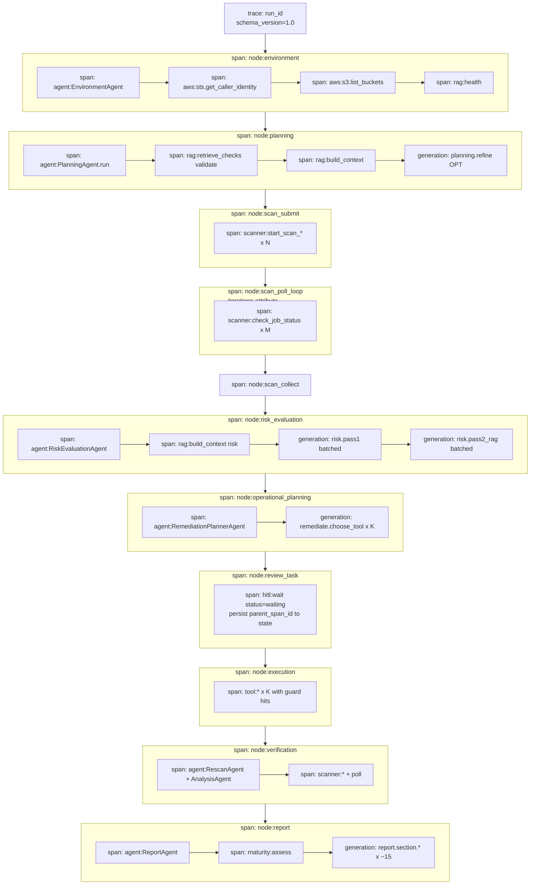

# Langfuse Integration — Production Architecture (LVTN-grade)

> **Audience**: Đội ngũ developer tích hợp Langfuse vào PDCA AWS Security Agent.
> **Scope**: Quyết định kiến trúc đã chốt — implement-once, không iterate nhiều lần.
> **Tham chiếu**: [SYSTEM_OVERVIEW.md](SYSTEM_OVERVIEW.md), [LANGFUSE_OPEN_QUESTIONS_ANALYSIS.md](LANGFUSE_OPEN_QUESTIONS_ANALYSIS.md), [REFACTOR_PLAN.md](../REFACTOR_PLAN.md).
> **Triết lý**: Mọi concern production (redaction, concurrency, resume, cost, failure isolation) đều là first-class citizen ngay từ đầu — KHÔNG defer sang "phase sau".

---

## 0. Decision Matrix (đã chốt)

| # | Decision | Lý do production |
|---|---|---|
| D1 | **1 run = 1 trace; `trace_id = run_id = LangGraph thread_id`** | Đã sẵn UUID; không sinh ID phụ; correlate được với checkpoint, log JSON, scanner DB |
| D2 | **Self-hosted Langfuse cho production**; cloud free-tier chỉ cho dev | AWS findings (account_id, ARN, bucket name) là PII tổ chức — không gửi ra third-party. LVTN demo có thể dùng cloud kèm redaction |
| D3 | **Redaction-by-default ở SDK boundary** (mọi giá trị gửi sang Langfuse đi qua `redact()`) | Defense-in-depth: developer thêm span mới không cần nhớ; an toàn cả khi trỏ cloud |
| D4 | **Trace topology cố định 4 tầng**: trace → node → agent/external → generation | Match cấu trúc graph hiện tại; đủ debug; không đẻ trace tree quá sâu |
| D5 | **LangChain `CallbackHandler` cho mọi LLM call** + **manual span cho non-LLM** | Auto cover ChatOllama; manual span chỉ cho RAG/scanner/boto3 — đủ và đúng chỗ |
| D6 | **Concurrency-safe từ đầu**: `contextvars.copy_context()` ở mọi entrypoint mới (HTTP, threadpool, BackgroundTasks) | Tránh debt khi build chatbot UI; CLI hiện tại không bị ảnh hưởng |
| D7 | **HITL pause persist `parent_span_id` vào PDCAState** ngay từ Phase 1 | Cross-process resume (chatbot UI) sẵn sàng — không phải refactor lần 2 |
| D8 | **Best-effort isolation**: Langfuse fail KHÔNG break pipeline; circuit-breaker sau N lỗi liên tiếp | Đồng nhất với pattern `RAGClient`, `EnvironmentAgent` đã có |
| D9 | **Sampling**: production trace 100%, generation 100% (self-host unlimited); dev cloud có flag `LANGFUSE_SAMPLE_RATE` | LLM debugging mất giá trị nếu sampling — phải full trace |
| D10 | **Bench runs default OFF** (`LANGFUSE_BENCH_ENABLED=false`) | Bảo vệ quota; bench đã có markdown report riêng |
| D11 | **Schema version cho span attribute** (`pdca.schema_version=1`) | Cho phép evolve attribute mà không break dashboard |
| D12 | **TimerCallback giữ song song Langfuse** (không xoá ngay) | Fallback offline + giữ `performance_metrics` artifact cho LVTN slide |
| D13 | **2 phase implementation** (Foundation + Full instrumentation) — không 5–6 phase nhỏ | Single-pass; ship được + production-ready |

---

## 1. System recap (đủ để bàn observability)

Pipeline LangGraph 12 node chu trình PDCA:

```
environment → planning → scan_submit → scan_poll⇄scan_poll → scan_collect
            → risk_evaluation
            → operational_planning → review_task (HITL pause) → reset_index
            → execution → verification → report
```

- State `PDCAState` TypedDict, persist `SqliteSaver`. Mỗi node trả dict delta.
- HITL: `interrupt_before=["review_task"]`. Caller update state rồi resume.
- `run_id` UUID = LangGraph `thread_id` = (sẽ là) Langfuse `trace_id`.

### 1.1 Điểm có LLM (auto trace qua callback)

| Node | Agent | Pattern | Provider |
|---|---|---|---|
| planning | `PlanningAgent` ([planning_agent.py:242](../pdca/agents/planning_agent.py#L242)) | 0–4 call (LLM-conditional + multi-intent) | Ollama (ChatOllama) |
| risk_evaluation | `RiskEvaluationAgent` ([risk_evaluation_agent.py:127](../pdca/agents/risk_evaluation_agent.py#L127)) | 2-pass × ⌈N/20⌉ batch | Ollama |
| operational_planning | `RemediationPlannerAgent` ([remediate_planner_agent.py:79](../pdca/agents/remediate_planner_agent.py#L79)) | 1/FAIL finding | Ollama |
| report | `ReportAgent` qua `LLMWriter` ([llm_writer.py:124](../pdca/agents/report_module/llm_writer.py#L124)) | ~15 section | Ollama |

Tất cả dùng `langchain_ollama.ChatOllama` → `usage_metadata` có sẵn → Langfuse `CallbackHandler` capture token tự động (xem [LANGFUSE_OPEN_QUESTIONS_ANALYSIS.md Q1](LANGFUSE_OPEN_QUESTIONS_ANALYSIS.md)).

### 1.2 Điểm non-LLM (manual span)

| Loại | Where | Span name |
|---|---|---|
| RAG HTTP | `RAGClient.*` | `rag:<endpoint>` |
| Scanner HTTP | `ScannerAgent`, `check_job_status`, `RescanAgent.poll` | `scanner:<endpoint>` |
| AWS boto3 | `EnvironmentAgent`, `ExecutionAgent.execute_task` | `aws:<service>` / `tool:<tool_name>` |
| Subprocess Prowler | `pdca/api_server.py` worker | KHÔNG instrument — chỉ link qua `job_id` (decision Q6) |

---

## 2. Architecture decisions (chi tiết + production rationale)

### 2.1 Trace topology — 4 tầng cố định

```
trace                          (1 per pipeline run)
└── span: node:<name>          (12 node, ~12 span)
    ├── span: agent:<Class>    (1 per node có agent)
    │   ├── generation:*       (LLM calls — auto từ CallbackHandler)
    │   └── span: rag:* / scanner:* / aws:* / tool:*  (external)
    └── (nếu node thuần adapter, agent span có thể bỏ — flat)
```

**KHÔNG đi sâu hơn 4 tầng**: pure-logic helper (`_score_candidates`, `_detect_service`...) KHÔNG tạo span. Lý do: noise vô ích cho debug; thêm cost storage; bão observation khi N findings lớn.

### 2.2 Identity model

| Concept | ID | Source |
|---|---|---|
| Trace | `trace_id = run_id` | UUID tạo ở entrypoint (CLI / HTTP) |
| Node span | `name=node:<n>`, `id=auto` | LangGraph node function |
| Agent span | `name=agent:<Class>` | Agent constructor |
| Generation | `name=<agent>.<purpose>` | LangChain CallbackHandler |
| Cross-cutting attr | `finding_uid`, `task_id`, `job_id` | Span attribute (filter trong UI) |

**Invariant I-1**: Không tạo UUID phụ. Mọi cross-ref dùng identifier có sẵn trong state.

### 2.3 Concurrency model (decision Q4)

**Thiết kế cho cả 3 case từ đầu** — không refactor sau:

| Case | Cơ chế |
|---|---|
| CLI single-thread sync (hiện tại) | `set_run_id(run_id)` đầu entrypoint, ContextVar tự propagate |
| FastAPI request handler (chatbot UI tương lai) | Middleware/dependency: read `X-Run-Id` header hoặc generate; `set_run_id` đầu request |
| BackgroundTasks / threadpool (api_server hiện tại) | Helper `run_with_run_id(run_id, fn)` wrap `contextvars.copy_context().run(...)` — bắt buộc dùng khi spawn child thread/task |

**Invariant I-2**: Mọi entrypoint **PHẢI** set `run_id` ContextVar + start Langfuse trace cùng id ở line đầu. Không có entrypoint nào được phép skip.

**Implementation point**: Helper `pdca/observability/context.py:run_with_context(run_id, fn, *args, **kwargs)` được tạo Phase 1, dùng cho mọi thread spawn từ ngày đầu.

### 2.4 Data residency & redaction (decision D2 + D3)

#### Data classification

| Loại | Sensitivity | Action |
|---|---|---|
| `aws.account_id` | PII tổ chức | Redact thành `***<last 4>` ở cloud, full ở self-host internal |
| `arn:aws:*:*:<account>:resource` | PII | Redact account portion |
| `bucket name`, `resource_id` | PII tổ chức | Redact theo regex (giữ prefix prefix, hash suffix) |
| `identity_arn` | PII | Redact account portion |
| OCSF raw finding | Mixed | KHÔNG gửi raw — chỉ gửi `finding_id, severity, status, check_id` |
| `tool_params` (boto3) | Mixed | Sanitize trước khi log: bucket name → hash; ARN → redact |
| Source code tool (`AnalysisAgent._load_tool_source`) | Internal code | KHÔNG gửi (tốn token, không value) |
| AWS credentials | SECRET | Tuyệt đối KHÔNG — guard ở SDK boundary |
| `user_request` NL | Public/internal | OK gửi full (input của assessment) |
| LLM prompt + completion | Mixed (chứa ARN trong context) | Redact pass trước khi callback handler send |

#### Redaction implementation

- Module `pdca/observability/redaction.py` cung cấp `redact(value: Any, mode: Literal["full", "internal", "off"]) -> Any`.
- Modes:
  - `"full"` (production cloud): redact tất cả PII fields theo bảng trên.
  - `"internal"` (self-host private network): keep account_id + ARN; chỉ redact AWS credentials.
  - `"off"` (CI/test): không redact.
- Mode chọn từ setting `langfuse_redact_mode` (default `"full"` — fail-safe).
- Pre-send hook: Langfuse SDK có `mask_input/mask_output` — wire `redact()` vào đó.

**Invariant I-3**: Mọi span attribute, prompt, completion gửi sang Langfuse **PHẢI** đi qua `redact()`. Tests bắt buộc cho ARN/credential leakage.

### 2.5 Resume & HITL pause (decision Q3 + D7)

**Vấn đề**: HITL có thể kéo dài hàng giờ; chatbot UI tương lai có resume cross-process.

**Quyết định ngay từ đầu** (không defer):

1. **HITL `review_task` mở 1 span riêng `hitl:wait`** với `status="waiting"`.
2. Khi node trước `review_task` chạy xong, trace **flush + lưu `parent_span_id`** vào PDCAState (NotRequired field `_langfuse_parent_span_id: str`).
3. Khi resume:
   - Same process: span chưa đóng — continue.
   - Cross-process (chatbot UI): tạo span mới với `parent_observation_id=state["_langfuse_parent_span_id"]`.
4. Khi user decide → đóng `hitl:wait` với `output={decision, latency_human_ms}`.

**Invariant I-4**: PDCAState có optional fields `_langfuse_*` để persist trace context — đã sẵn cho chatbot UI Phase 3 của REFACTOR_PLAN, không refactor lần 2.

### 2.6 Failure isolation (D8)

| Failure mode | Behavior |
|---|---|
| `Langfuse(...)` init fail (key sai) | `get_langfuse_handler()` return `None`, log warning 1 lần, pipeline tiếp tục |
| Network down giữa run | SDK background flush silently fail; pipeline tiếp tục |
| N lỗi liên tiếp (>5 flush fail trong 60s) | Circuit-breaker trip → `get_langfuse_handler()` skip cho phần còn lại của process |
| Langfuse host quá chậm (>2s/flush) | Timeout cứng ở SDK config; không block pipeline thread |
| `redact()` exception | Catch + thay bằng `"<redaction-error>"` — không crash span |

**Invariant I-5**: Pipeline pass tất cả tests E2E ngay cả khi `LANGFUSE_HOST=http://invalid.local`.

### 2.7 Sampling & cost (D9 + D10)

| Mode | Trace sample | Generation sample | Khi dùng |
|---|---|---|---|
| `production` (self-host) | 100% | 100% | Default |
| `dev_cloud` | 100% | 100% (vì free 50K đủ ~6 run/ngày) | Dev với cloud free tier |
| `bench` | 0% (skip hoàn toàn) | 0% | `LANGFUSE_BENCH_ENABLED=false` mặc định trong runner |
| `ci` | 0% | 0% | Tests dùng mock |

**KHÔNG sample partial generation** — Risk eval batched 2 pass mất 1 pass = vô nghĩa khi debug.

### 2.8 Span attribute schema (D11)

Mọi span đặt `pdca.schema_version="1.0"` để future migration. Attribute namespacing:
- `pdca.*` — domain-specific (run_id, finding_uid, task_id, decision...).
- `aws.*` — AWS-specific (account_id_redacted, region).
- `rag.*`, `scanner.*` — service-specific.
- `langfuse.*` — reserved cho SDK.

---

## 3. Mapping system ↔ Langfuse (firm contract)

| System concept | Langfuse | Identifier | Lifecycle |
|---|---|---|---|
| 1 LangGraph run | **Trace** | `id=run_id` | Open: entrypoint. Close: pipeline END / exception |
| 1 node invoke | **Span** | `name=node:<n>` | Open: node start. Close: node return |
| 1 agent `.run()` | **Span** | `name=agent:<Class>` | Open: trước `agent.run()`. Close: sau return |
| 1 `ChatOllama.invoke` | **Generation** | auto từ CallbackHandler | Tự động |
| 1 RAG/scanner/AWS HTTP | **Span** | `name=<svc>:<endpoint>` | Open: trước HTTP. Close: sau response/exception |
| `ExecutionAgent.execute_task` | **Span** | `name=tool:<tool_name>` | Open: trước `tool.invoke`. Close: sau classify_result |
| HITL pause | **Span** | `name=hitl:review_task` | Open: enter review_task. Close: state update |
| `scan_poll` loop (toàn bộ) | **Span** | `name=node:scan_poll_loop` | Open: lần poll đầu. Close: route → scan_collect |
| Mỗi `check_job_status` | **Span** con | `name=scanner:check_job_status` | Per HTTP call |

### 3.1 Trace metadata (set ở root span)

Bắt buộc:
- `pdca.run_id`, `pdca.user_request` (redacted nếu cần)
- `aws.account_id` (redacted theo mode), `aws.region`
- `pdca.model = settings.ollama_model`
- `pdca.rag_available`
- `pdca.schema_version = "1.0"`
- Tags: `[pdca, security_assessment, env=<dev|staging|prod>]`

Set sau planning (update trace):
- `pdca.plan.groups`, `pdca.plan.checks_count`, `pdca.plan.fast_track`

Set sau verification (update trace):
- `pdca.outcome.fixed`, `pdca.outcome.failed`, `pdca.outcome.manual`
- `pdca.outcome.tag ∈ {success, partial_failure, degraded}`

### 3.2 Per-step capture spec

| Span/Generation | Input | Output | Attribute |
|---|---|---|---|
| trace root | `user_request` (full) | `final_report_path`, outcome tag | run_id, model, account, region, tags |
| node:* | (kế thừa) | state delta keys + sizes | node_name, duration_ms |
| agent:* | summary (counts, query truncate 500c) | summary (counts, status) | agent_class |
| generation:* | system + user prompt (redacted) | completion (redacted) | model, temperature, format, prompt_tokens, completion_tokens |
| rag:* | query (truncate), top_k, mode | count, confidence, source | endpoint, http_status, latency_ms |
| scanner:* | group/check_ids/job_id | status, finding_count | endpoint, http_status |
| aws:* | service, operation | status | region, error_code (nếu fail) |
| tool:* | tool_name, params (sanitized) | status, success | task_id, finding_uid, decision, error_code |
| hitl:wait | task summary | decision | task_idx/total, latency_human_ms |

---

## 4. Trace flow design



---

## 5. Implementation specification

### 5.1 Module layout (mới)

```
pdca/observability/
├── logger.py            (đã có)
├── context.py           (MỚI — run_with_context, set_run_id_safe)
├── redaction.py         (MỚI — redact() + tests)
├── langfuse_client.py   (MỚI — get_handler, get_client, circuit_breaker)
└── tracing.py           (MỚI — @traced decorator + span() context manager)
```

### 5.2 Settings additions

Thêm vào [pdca/config/settings.py](../pdca/config/settings.py):

```python
# Langfuse — production-ready
langfuse_enabled: bool = False                          # master switch
langfuse_secret_key: Optional[str] = None
langfuse_public_key: Optional[str] = None
langfuse_host: str = "https://cloud.langfuse.com"
langfuse_redact_mode: Literal["full","internal","off"] = "full"
langfuse_environment: Literal["dev","staging","prod"] = "dev"
langfuse_flush_at_node: bool = True                     # flush sau mỗi node (HITL safe)
langfuse_circuit_breaker_threshold: int = 5             # N flush fail liên tiếp
langfuse_circuit_breaker_window_s: int = 60
langfuse_bench_enabled: bool = False                    # bench runner default OFF
langfuse_sample_rate: float = 1.0                       # 0.0–1.0
```

### 5.3 Wire points (single-pass implementation)

| File | Thay đổi | Lý do |
|---|---|---|
| `pdca/observability/langfuse_client.py` | Tạo factory + circuit breaker | Foundation |
| `pdca/observability/redaction.py` | `redact(value, mode)` | Defense at boundary |
| `pdca/observability/tracing.py` | `@traced("name")` decorator + `span()` ctx mgr | Manual span ergonomics |
| `pdca/observability/context.py` | `run_with_context()` helper | Concurrency-safe |
| `pdca/agents/shared/callbacks.py` | `get_callbacks(extra=)` thêm Langfuse handler nếu enabled | Auto-LLM trace |
| `pdca/graph/state.py` | Thêm `_langfuse_parent_span_id: NotRequired[str]` | Resume support |
| `pdca/graph/nodes/*.py` | Wrap node body bằng `with span("node:<n>")` | 12 file × 5 dòng |
| `pdca/graph/nodes/review_task.py` | Persist parent_span_id, mở `hitl:wait` | HITL trace |
| `pdca/graph/nodes/scan_poll.py` | Mở `scan_poll_loop` 1 lần, sub-span mỗi check | Tránh tall trace |
| `pdca/agents/shared/rag_client.py` | Wrap mỗi method bằng `span("rag:<n>")` | Non-LLM external |
| `pdca/tools/scanner.py`, `pdca/tools/remediation/s3.py` | Wrap `@tool` body bằng span | Tool-level |
| `pdca/agents/execution_agent.py` | Wrap `execute_task` + tag với `task_id, finding_uid` | Audit trail |
| `pdca/agents/environment_agent.py` | Wrap STS/S3 call | AWS span |
| `pdca/orchestrator.py` | Khởi tạo trace + flush ở entry/exit | Trace lifecycle |
| `pdca/api_server.py` | (NẾU instrument) wrap endpoints — Decision: KHÔNG instrument scanner API hiện tại | Q6 decision |
| `requirements.txt` | Pin `langfuse>=3.0,<4.0`, pin `langchain-ollama` để giữ `usage_metadata` | Version safety |
| `tests/test_langfuse_*.py` | Test redaction, circuit breaker, propagation | Acceptance |
| `benchmarks/*/run_*.py` | Force `LANGFUSE_ENABLED=false` đầu script | Cost guard |

### 5.4 Span lifecycle invariants (developer rules)

1. **Mọi `with span("name")`** phải đặt `pdca.schema_version="1.0"` (decorator/helper tự inject).
2. **KHÔNG** gọi `langfuse.*` trực tiếp ngoài module `pdca/observability/` — đi qua wrapper.
3. **Mỗi span phải set output hoặc status** trước khi exit (decorator handle exception → status="error").
4. **Redaction là tự động** — developer KHÔNG được tự gọi `langfuse.span(input=raw_data)`. Phải `span("name", input=data)` qua wrapper, wrapper redact rồi forward.
5. **Flush sau mỗi node** (do `langfuse_flush_at_node=True`) — đảm bảo HITL pause không mất trace.

---

## 6. Production guardrails

### 6.1 Nên log
- LLM prompt + completion (đã redact).
- Tool params (sanitized).
- RAG query + top candidate IDs.
- Status / error codes / exception types.
- Latency, retry count.
- Identifiers: `run_id, task_id, finding_uid, job_id`.

### 6.2 KHÔNG log (hard guards trong `redact()`)
- AWS credentials → regex hard-fail nếu thấy `AKIA[A-Z0-9]{16}`.
- Toàn bộ findings raw OCSF — chỉ `{finding_id, check_id, severity, status}`.
- Full PDCAState — chỉ delta keys + sizes.
- Source code tool.
- Bucket/resource ID nguyên dạng — hash hoặc redact suffix.

### 6.3 Anti-noise rules
- Pure-logic helper KHÔNG span (`_score_candidates`, `_detect_service`).
- Risk eval: 1 generation/batch (không 1/finding).
- `scan_poll`: 1 loop span + N sub-span check.
- Truncate prompt nếu > 8K char ở wrapper.
- `bench`/`ci` → handler = None.

### 6.4 Cẩn trọng riêng
- **HITL kéo dài**: `flush_at_node=True` đảm bảo trace partial visible trên UI dù user chưa decide.
- **`scan_poll` blocking sleep**: vẫn OK vì handler background flush; nhưng circuit-breaker sẽ trip nếu Langfuse host down lâu.
- **`langchain` version drift**: pin `langchain>=0.3,<0.4` + `langchain-ollama` cùng version với Langfuse SDK matrix support.
- **`PlanningAgent` non-BaseAgent**: pattern callbacks identical (verified) — wire qua `callbacks` param OK.
- **Subprocess Prowler**: KHÔNG instrument; `job_id` là bridge identifier.

---

## 7. Implementation plan — 2 phase, single-pass

### Phase F — Foundation (1 PR; ~400 LoC + tests)

**Mục tiêu**: Toàn bộ infra observability sẵn sàng; pipeline chạy nguyên không-side-effect khi `LANGFUSE_ENABLED=false` (mặc định).

Deliverables:
1. `pdca/observability/{context,redaction,langfuse_client,tracing}.py` đầy đủ + unit tests.
2. Settings mở rộng (D11 fields) + validation.
3. `pdca/agents/shared/callbacks.py` mở rộng `get_callbacks(extra)`.
4. `pdca/graph/state.py` thêm `_langfuse_parent_span_id`.
5. Tests: redaction (ARN/credential), circuit breaker, no-op khi disabled, ContextVar isolation thread.
6. Pin versions trong `requirements.txt`.
7. Doc: `docs/observability/runbook.md` (failure modes + dashboard URL placeholder).

**Acceptance criteria F**:
- F1. `pytest tests/test_langfuse_*.py` pass.
- F2. `pytest tests/test_phase_c_graph.py` pass nguyên (regression).
- F3. Set `LANGFUSE_HOST=http://invalid.local LANGFUSE_ENABLED=true` + chạy E2E → pipeline pass; circuit breaker trip; log warning.
- F4. Test ARN leak: gọi `redact("arn:aws:s3:::secret-bucket", mode="full")` → assert account masked.
- F5. Concurrency test: 10 thread × `run_with_context(run_id_i, fn)` → mỗi thread thấy `get_run_id() == run_id_i`.

### Phase I — Full instrumentation (1 PR; ~600 LoC + tests)

**Mục tiêu**: Tất cả wire points trong §5.3 được instrument; trace e2e đầy đủ trên Langfuse UI.

Deliverables:
1. Wrap 12 node với `with span(...)` (5 dòng/node).
2. Wrap RAGClient methods (~6 method).
3. Wrap scanner tools + remediation tools.
4. Wrap `EnvironmentAgent`, `ExecutionAgent.execute_task`.
5. `review_task` persist `parent_span_id` + mở `hitl:wait`.
6. `orchestrator.py` lifecycle: trace start ở entry, flush ở `finally`.
7. Trace metadata: set sau `environment` + `planning` + `verification` (update trace).
8. Score hooks (D3 evaluation): planning confidence, risk severity dist, verification outcome, report validation issues.
9. Bench runner force-disable Langfuse.
10. Tests: 1 trace tree validation (mock client), redaction E2E, HITL span lifecycle.
11. Doc: dashboard layout đề xuất + filter recipes.

**Acceptance criteria I**:
- I1. Run 1 E2E thật với self-host Langfuse → UI hiển thị trace có đủ tree theo §4.
- I2. Click vào 1 generation → thấy prompt + completion + token + redacted ARN.
- I3. Filter trace bằng tag `outcome=partial_failure` hoạt động.
- I4. Mock cloud-down → pipeline complete, log có "circuit breaker tripped".
- I5. HITL test: pause → kill process → restart cùng `thread_id` → trace UI hiển thị `hitl:wait` resolved (yêu cầu chatbot UI Phase 3 — test này có thể là manual verification scenario).
- I6. Bench run với default settings → 0 observation gửi Langfuse.
- I7. Audit security: grep prompt/completion trong UI → 0 occurrence của `AKIA*` hoặc full account_id (12 digits).

---

## 8. Testing strategy (LVTN-grade)

### 8.1 Unit tests (Phase F)
- `test_redaction.py`: ARN/credential/account_id mỗi mode (full/internal/off).
- `test_circuit_breaker.py`: trip sau N fail; reset sau cooldown.
- `test_context.py`: `run_with_context` thread isolation.
- `test_langfuse_client.py`: factory return None khi disabled / key missing.

### 8.2 Integration tests (Phase I)
- Mock Langfuse SDK; verify span tree shape match §4.
- HITL: span `hitl:wait` mở, persist parent_span_id, đóng đúng output.
- Failure injection: HTTP 500 từ Langfuse → pipeline ok.

### 8.3 E2E acceptance (manual + scripted)
- `scripts/run_e2e_auto.py` với `LANGFUSE_ENABLED=true LANGFUSE_HOST=<self-host>` → manual verify UI.
- Checklist trong `docs/observability/acceptance_checklist.md`.

### 8.4 Performance regression
- Benchmark: 1 E2E run latency với/không Langfuse → diff < 5% (callback overhead chấp nhận được).
- Memory: span buffer max < 50MB trong 1 run.

---

## 9. Operational runbook

### 9.1 Dashboard requirements (UI Langfuse)
- View 1 — **Run timeline**: list trace recent có outcome tag, latency, model.
- View 2 — **Per-node latency**: heatmap theo node × thời gian.
- View 3 — **LLM token usage**: top prompt by token, cost projection.
- View 4 — **Error explorer**: filter `level=error` ở span attributes.
- View 5 — **HITL latency**: `hitl:wait.duration` distribution.

### 9.2 Failure modes & response

| Symptom | Likely cause | Action |
|---|---|---|
| 0 trace trong UI dù `enabled=true` | Wrong key / network block | Check `langfuse_client.py` log; verify `/api/health` self-host |
| Trace có root + node nhưng thiếu generation | LangChain version mismatch | Pin lại `langchain-ollama` |
| Generation không có token | ChatOllama version cũ | Pin `langchain-ollama>=0.2` (`usage_metadata` field) |
| Trace tree "phẳng" (mọi span cùng cấp) | Forgot context propagation | Verify `with span(...)` lồng đúng — không break by exception |
| Span `hitl:wait` không đóng | Resume code không đọc `parent_span_id` | Check `orchestrator.handle_task_review_interaction` |
| Pipeline chậm 50%+ | Sync flush blocking | Verify SDK config `flush_at_close_only=False`; reduce `flush_at_node` xuống node quan trọng |
| Account_id leak trong UI | Redact mode sai | Force `langfuse_redact_mode=full` ở env prod |

### 9.3 On-call procedure
- Langfuse host down >5 phút → circuit breaker tự trip; không cần can thiệp.
- Quota exceeded (cloud) → switch sang self-host hoặc tăng tier; pipeline không bị ảnh hưởng.
- Disk full ở self-host → Postgres down → circuit breaker; backup + clean events >90 ngày.

---

## 10. Production readiness checklist (LVTN gate)

Trước khi merge và demo LVTN:

- [ ] Tất cả 13 decision (D1–D13) reflected trong code.
- [ ] 5 invariants (I-1 → I-5) có test coverage.
- [ ] Acceptance F1–F5 + I1–I7 pass.
- [ ] Self-host Langfuse setup được document hoặc compose file ở `deploy/langfuse/`.
- [ ] Redaction audit: grep UI sau 1 demo run không lộ secret.
- [ ] Performance: < 5% latency overhead.
- [ ] Failure injection test pass.
- [ ] Runbook §9 review bởi maintainer.
- [ ] Dashboard 5 view setup.
- [ ] Bench run default-off được test.
- [ ] HITL parent_span_id persist test (manual cross-process scenario document).

---

## 11. Decision Log (open questions đã chốt)

Tất cả 8 open questions của tài liệu V1 đã được trả lời chi tiết với evidence trong [LANGFUSE_OPEN_QUESTIONS_ANALYSIS.md](LANGFUSE_OPEN_QUESTIONS_ANALYSIS.md). Tóm tắt quyết định:

| Q | Decision (final) |
|---|---|
| Q1 Token usage | ChatOllama trả `usage_metadata` → auto capture; pin `langchain-ollama>=0.2` |
| Q2 Cloud vs self-host | Self-host cho prod; cloud cho dev + redaction-by-default |
| Q3 Resume | First-class từ Phase F: persist `_langfuse_parent_span_id` vào PDCAState |
| Q4 Concurrency | Helper `run_with_context` từ Phase F; FastAPI middleware cho chatbot UI |
| Q5 PlanningAgent | KHÔNG refactor; pattern callbacks đã đúng — verify bằng smoke test |
| Q6 Subprocess Prowler | KHÔNG instrument; bridge qua `job_id` attribute |
| Q7 Cost | Self-host unlimited; bench default OFF; sample 100% production |
| Q8 Datasets migrate | KHÔNG trong scope LVTN; có thể làm sau khi production stable |

Không còn open question — mọi item đã có hoặc decision hoặc owner.
